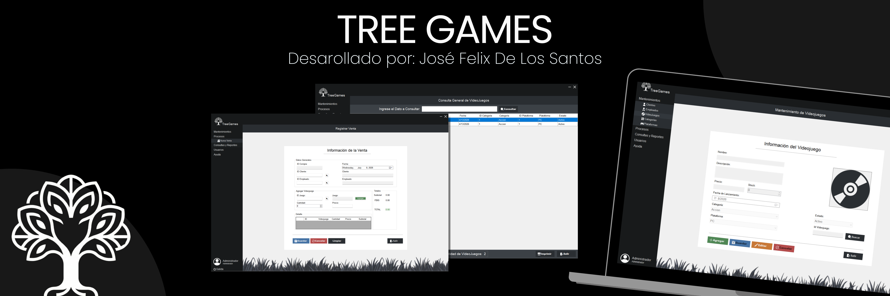

# TGAS - TreeGames Administration System

## Academic Information

**Course:** Programming II
**Professor:** Jose Ramon Capellan
**University:** Universidad Católica del Cibao (UCATECI)  
**Student:** José Felix DLS  
**Student ID:** 2024-1135

## Project Objective

The objective of this project is to develop a desktop application that streamlines the management of a video game retail store. TGAS allows administrators and cashiers to register, search, update, and track inventory, clients, employees, purchases, and sales through an intuitive Windows Forms interface backed by a SQL Server database.

## Description

TGAS is a Windows Forms application (.NET Framework) developed using a classic three-layer architecture (Data, Business, Presentation). It features role-based access control (Admin / Cashier), secure login with password hashing, complete CRUD operations for all entities, and integrated RDLC reporting. The application manages the full sales cycle from inventory intake to purchase registration with detailed line-item tracking.

## Included Modules

- **Login & User Management:** Secure authentication with SHA-256 password hashing, role-based access, and user CRUD.
- **Platforms:** Register and manage gaming platforms (PlayStation, Xbox, Nintendo, PC, etc.).
- **Categories:** Organize video games by genre/category.
- **Video Games:** Full inventory control — register, edit, search, and track stock.
- **Clients:** Client registry with search and maintenance capabilities.
- **Employees:** Employee management with role assignment.
- **Purchases:** Purchase order registration with detailed line items (DetalleCompra).
- **Reports:** Generate and view reports for categories, clients, employees, platforms, and video games via RDLC.

## Features

- Role-based login system (Admin / Cashier) with password hashing.
- Full CRUD (Create, Read, Update, Delete) for all entities.
- Interactive search and filter functionality across modules.
- Purchase registration with real-time item detail tracking.
- Integrated reporting using SQL Server Reporting Services (RDLC).
- Modern UI with custom icon assets and intuitive navigation.
- SQL Server LocalDB database with stored procedures for data operations.

## Technologies Used

- C# / .NET Framework 4.7.2 (Windows Forms)
- Three-layer architecture (CapaDatos, CapaNegocio, CapaPresentación)
- SQL Server LocalDB with stored procedures
- RDLC Reports (Microsoft Reporting Services)
- Visual Studio 2022

## Project Status

Completed academic project developed for educational purposes.
